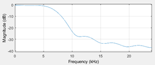
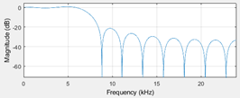
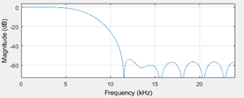
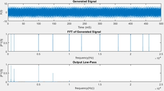
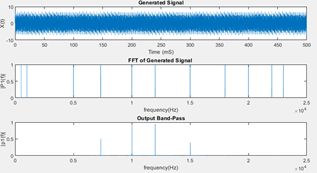
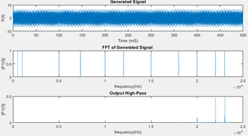
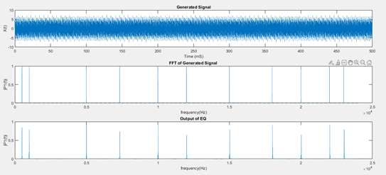

# Digital Signal Processing

Work completed for a university module on DSP.

  Equaliser bandwidth	:	22kHz
        Low pass band	:	0→7.33kHz
      Band pass band	:	7.33→14.66 kHz
      High pass band	:	14.66→22kHz
     Pass band ripple	:	max. 5%
  Stop band rejection	:	min 40 dB
Sampling frequency fs	:	48kHz

### Selecting the window type

A hamming window was chosen as it was the most fitting window for the specifications, due to its low ripple and steep transition band. This is shown when comparing different windows:

Triangluar Window:

Rectangular Window:

Hamming Window:

### After selecting the window type, the filters can be constructed

Creating the lowpass filter:

Creating the Bandpass filter:

Creating the Highpass filter:

The combination of the filters:

